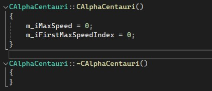
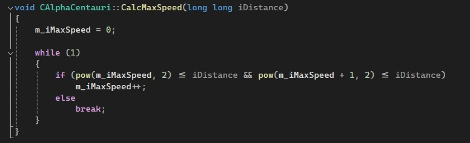
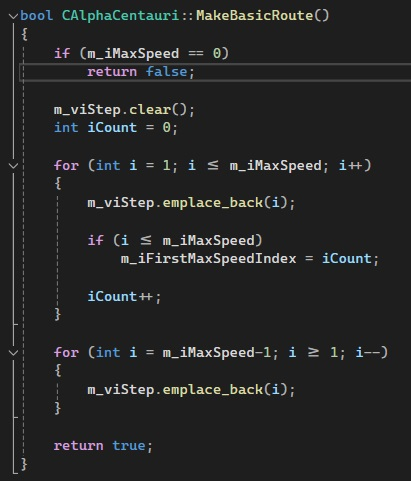
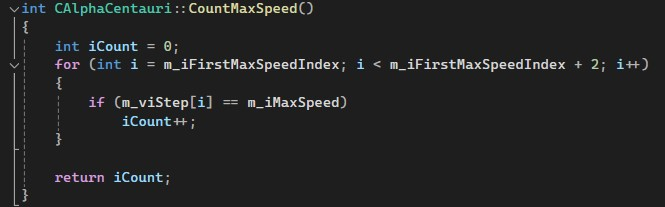
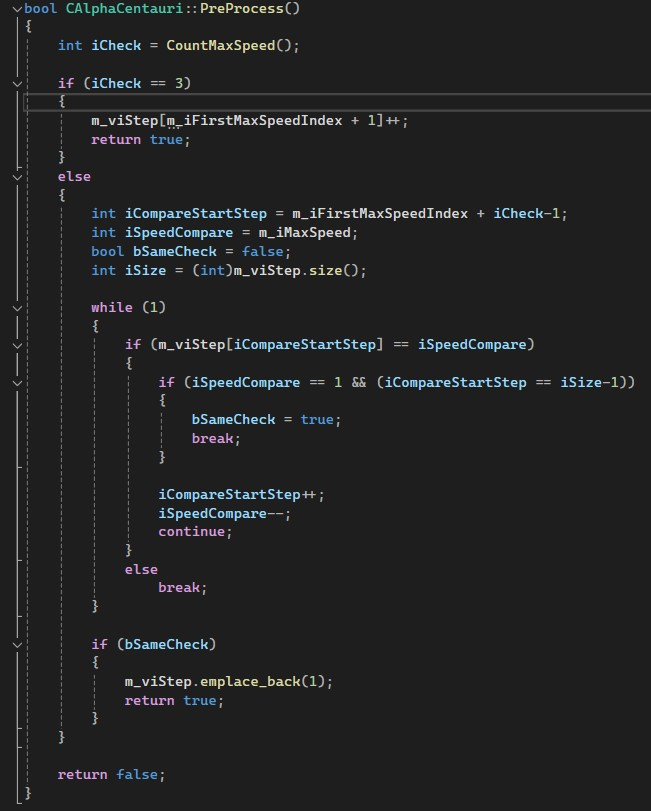
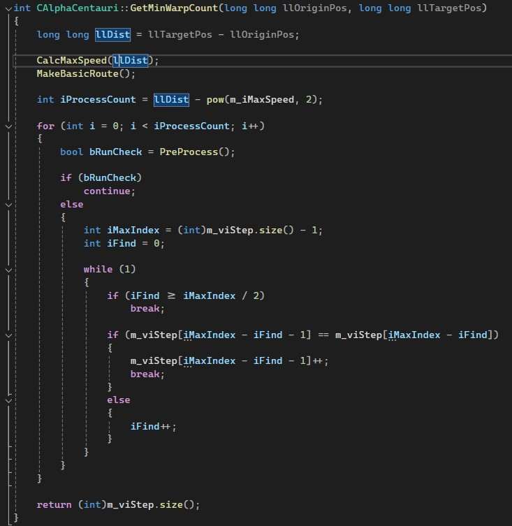

# 코딩 스타일 견본[Fly me to the Alpha Centauri]

   
  
  
   

목차

1. 프로젝트 개요
2. 코드 설명 및 코드의 로직 작성 이유
3. 느낀점

## 1. 프로젝트 소개

<table>
  <tr>
    <td style="width: 30%; vertical-align: top;">
      
    </td>
    <td style="width: 70%; vertical-align: top; text-align: left;">
      <h3>프로젝트 개요/동기</h3>
      <ul>
        <li>자주 사용하는 코딩 스타일 견본을 위한 깃허브 프로젝트입니다.</li>
        <li>코딩테스트 사이트인 백준의 https://www.acmicpc.net/problem/1011 를 해결하면서 작업한 프로그램을 견본으로 사용했습니다.</li>
      </ul>
    </td>
  </tr>
</table>

## 기술 스택

|	C++	    |   MFC   |
|:------: |:------: |
|![c++]   | ![mfc]  |

 

## 2. 코드 설명

### 2-1. AlphaCentauri-Constructor_Destructor
<table>
  <tr>
    <td style="width: 30%; vertical-align: top;">
      
    </td>
    <td style="width: 70%; vertical-align: top; text-align: left;">
      <ul>
        <li>컨스트럭터에서 객체의 초기화에 필요한 부분들을 진행</li>
        <li>디스트럭터에서는 해당 객체의 수명주기와 같은 포인터변수등이 있을 경우 할당해제등을 진행</li>
      </ul>
    </td>
  </tr>
</table>

### 2-2. AlphaCentauri-CalcMaxSpeed
<table>
  <tr>
    <td style="width: 30%; vertical-align: top;">
      
    </td>
    <td style="width: 70%; vertical-align: top; text-align: left;">
      <ul>
        <li>엑셀을 활용하여 예시 데이터 및 예상 데이터를 분석하였고 그 결과 최대 속도는 해당 방식으로 구할 수 있을것을 확인</li>
      </ul>
    </td>
  </tr>
</table>

### 2-3. AlphaCentauri-MakeBasicRoute
<table>
  <tr>
    <td style="width: 30%; vertical-align: top;">
      
    </td>
    <td style="width: 70%; vertical-align: top; text-align: left;">
      <ul>
        <li>기본적으로 최대 속도까지 가속하며 올라가는 구간과 도착지에 최저속도로 감속하여 도달해야 하는 구간의 뼈대가 될 속도가 들어있는 배열 준비를 위한 기능</li>
      </ul>
    </td>
  </tr>
</table>

### 2-4. AlphaCentauri-CountMaxSpeed
<table>
  <tr>
    <td style="width: 30%; vertical-align: top;">
      
    </td>
    <td style="width: 70%; vertical-align: top; text-align: left;">
      <ul>
        <li>최고 속력을 유지하는 Step의 개수를 구하는 기능</li>
      </ul>
    </td>
  </tr>
</table>

### 2-5. AlphaCentauri-PreProcess
<table>
  <tr>
    <td style="width: 30%; vertical-align: top;">
      
    </td>
    <td style="width: 70%; vertical-align: top; text-align: left;">
      <ul>
        <li>이후 계산을 조금 더 편하게 하기위해 전처리를 하는 기능</li>
      </ul>
    </td>
  </tr>
</table>

### 2-6. AlphaCentauri-GetMinWarpCount
<table>
  <tr>
    <td style="width: 30%; vertical-align: top;">
      
    </td>
    <td style="width: 70%; vertical-align: top; text-align: left;">
      <ul>
        <li>많은 함수 호출 및 이름과 맞지않는 Run 및 Set동작등이 포함되어있지만 기능적으로는 기본적 계산과 그 이후 계산을 위한 뼈대 작성 및 마무리 계산의 전처리, 후처리 기능을 하고있는 함수</li>
      </ul>
    </td>
  </tr>
</table>

 

## 3. 느낀점

 

## 라이센스

MIT &copy; [NoHack](mailto:lbjp114@gmail.com)

<!-- Stack Icon Refernces -->

[git]: /images/stack/Git.svg
[github]: /images/stack/GithubDesktop.svg
[ue]: /images/stack/UnrealEngine.svg
[bd]: /images/stack/Blender.svg
[c++]: /images/stack/C++.svg
[mfc]: /images/stack/Microsoft_Foundation_Class.svg
